<p align="center">
  
</p>

<h1 align="center">anotify</h1>

<p align="center">
  <strong>A quiet desktop inbox for remote agents.</strong>
</p>

<p align="center">
  Send job results, failures, messages, and approval requests from an HPC cluster,<br/>
  VPS, CI runner, or AI agent to one small desktop app.
</p>

<p align="center">
  
  
  
  
</p>

<p align="center">
  
</p>

> [!NOTE]
> **Public beta.** Unsigned desktop installers are available from [GitHub Releases](https://github.com/cupcake777/anotify/releases/latest). The project named `anotify` on PyPI is unrelated; install the Python CLI from this repository.

A long job should not require a terminal vigil. An agent should not wait forever for one human decision. `anotify` gives remote work a short path back to your desktop:

```bash
# Report a result
anotify send "Training finished" --title "HPC" --priority high

# Wait for a desktop decision
if anotify approve "Deploy the new build?" --agent codex; then
  ./deploy.sh
fi
```

The remote machine only makes outbound HTTP requests. No inbound agent port, chat workspace, or remote shell is required.

<table align="center">
  <tr>
    <td align="center" width="150">
      <br/>
      <strong>Complete</strong><br/><sub>Long jobs are done.</sub>
    </td>
    <td align="center" width="150">
      <br/>
      <strong>Error</strong><br/><sub>Something needs you.</sub>
    </td>
    <td align="center" width="150">
      <br/>
      <strong>Message</strong><br/><sub>An agent checked in.</sub>
    </td>
    <td align="center" width="150">
      <br/>
      <strong>Approval</strong><br/><sub>A decision is waiting.</sub>
    </td>
  </tr>
</table>

## How it works

```text
 Remote host                        Relay                         Your desktop

 ┌──────────────────┐   HTTPS   ┌──────────────────┐  WebSocket  ┌──────────────────┐
 │ HPC / VPS / CI   │ ────────► │ anotify-server   │ ──────────► │ Tauri desktop    │
 │ AI coding agent  │   POST    │ FastAPI relay    │             │ toast + inbox    │
 └──────────────────┘           └──────────────────┘             └──────────────────┘
          ▲                              │                                │
          └──── outbound long-poll ──────┴──────── approval result ───────┘
```

There are three small pieces:

| Piece | Job |
|---|---|
| `anotify` | Python CLI used by jobs, scripts, CI, and agents to send events or wait for approval. |
| `anotify-server` | Self-hosted FastAPI relay: REST in, WebSocket out, with token auth and an in-memory buffer. |
| Desktop app | Tauri tray app with a live inbox, custom penguin toasts, connection status, silence mode, and approval actions. |

The Python tray client remains available as a compatibility path for traditional OS notifications. The Tauri app is the primary desktop experience.

## What you get

- **One command from anywhere** — send from Bash, Python, a scheduler, CI, or an agent tool call.
- **Useful context, not mystery popups** — attach source, host, working directory, script, agent, and priority.
- **Human approval without opening an inbound port** — the CLI posts a request and waits through outbound long-polling.
- **A calm desktop surface** — live inbox, connection state, tray access, deduplication, auto-reconnect, and silence mode.
- **A relay you control** — run it behind your own domain and TLS proxy; no managed account is required.
- **Small, explicit limits** — 2 KB payloads, 30 sends per minute per IP, and bounded in-memory history.

### What it is not

anotify is not a chat platform, durable event database, mobile push service, or remote execution system. It carries short signals and decisions. Keep logs, artifacts, and long-form output in the system that produced them.

## Quick start

This local walkthrough proves the full loop from sender to relay to desktop. It assumes Python 3.9+, Rust stable, Node.js 22+, and pnpm 10.

### 1. Install the CLI and relay

From the repository root:

```bash
python3 -m venv .venv
. .venv/bin/activate
python -m pip install -e ".[server]"
```

### 2. Start a local relay

```bash
ANOTIFY_TOKEN=local-dev-token \
  python server/server.py --host 127.0.0.1 --port 7799
```

`local-dev-token` is only for this loopback demo. Generate a long random token before exposing a relay.

### 3. Configure and open the desktop app

In a second terminal:

```bash
. .venv/bin/activate
anotify config \
  --server http://127.0.0.1:7799 \
  --token local-dev-token

cd desktop
pnpm install
pnpm tauri dev
```

### 4. Send the first signal

In a third terminal:

```bash
. .venv/bin/activate
anotify send "Training finished" \
  --title "HPC" \
  --priority high \
  --agent codex \
  --script train.py
```

The event should appear as a penguin toast and in the desktop inbox.

## Agent workflows

### Report completion or failure

```bash
if python train.py --epochs 100; then
  anotify send "Training succeeded" \
    --title "ML pipeline" \
    --priority high \
    --script train.py
else
  status=$?
  anotify send "Training failed with exit code ${status}" \
    --title "ML pipeline" \
    --priority critical \
    --script train.py
  exit "$status"
fi
```

### Gate a destructive action

```bash
if anotify approve "Remove the old deployment?" \
  --agent claude-code \
  --action delete \
  --target /srv/app/releases/previous \
  --timeout 600; then
  rm -rf /srv/app/releases/previous
else
  echo "Not approved"
fi
```

`anotify approve` exits with a shell-friendly code:

| Exit code | Meaning |
|:---:|---|
| `0` | Approved |
| `1` | Denied |
| `2` | Timed out or failed |

### Notify from GitHub Actions

```yaml
- name: Notify desktop
  if: always()
  env:
    ANOTIFY_SERVER: ${{ secrets.ANOTIFY_SERVER }}
    ANOTIFY_TOKEN: ${{ secrets.ANOTIFY_TOKEN }}
  run: |
    python -m pip install .
    anotify send "CI finished: ${{ job.status }}" \
      --title "GitHub Actions" \
      --priority high \
      --source "${{ github.repository }}"
```

The same two commands work from Codex, Claude Code, Hermes Agent, cron jobs, Slurm epilogues, and ordinary shell scripts. Give the process access to `anotify send` for status updates and `anotify approve` only when it genuinely needs a decision.

## Configuration

Values resolve in this order:

```text
CLI flags  >  environment variables  >  ~/.anotify.json
```

| Setting | CLI | Environment | Config key |
|---|---|---|---|
| Relay URL | `--server` | `ANOTIFY_SERVER` | `server` |
| Auth token | `--token` | `ANOTIFY_TOKEN` | `token` |
| Config path | — | `ANOTIFY_CONFIG` | — |

Save the common values once:

```bash
anotify config \
  --server https://notify.example.com \
  --token your-secret-token
```

Both the Python CLI and desktop app use the same config file. On Unix-like systems it is written with `0600` permissions. The Tauri backend masks an existing token before returning settings to the WebView.

## Self-hosting

Run the relay on a server you control and terminate TLS with nginx, Caddy, or another reverse proxy that supports WebSocket upgrades.

```bash
. .venv/bin/activate
ANOTIFY_TOKEN='replace-with-a-long-random-secret' \
  python server/server.py --host 127.0.0.1 --port 7799
```

Check it locally:

```bash
curl http://127.0.0.1:7799/api/health
```

Then proxy both the REST endpoints and `/ws` to port `7799`, and configure senders with the public HTTPS base URL:

```bash
anotify config \
  --server https://notify.example.com \
  --token replace-with-a-long-random-secret
```

See [`server/README.md`](server/README.md) for endpoints, Docker notes, and deployment details.

## Security model

- Set `ANOTIFY_TOKEN`, `--token`, or `--token-file` on every non-local relay.
- Put TLS in front of the relay. Tokens and notification text are otherwise readable in transit.
- Sender and desktop credentials use HTTP Bearer authentication in the `Authorization` header; query-string tokens exist only as a compatibility fallback.
- A self-hosted global token has full relay access. Workspace deployments can create separate sender and receiver roles, but those workspaces are currently in memory.
- Relay history is in memory and disappears on restart. Both relay and desktop session history are bounded.
- Notification text is not a secret store. Send a short summary and keep sensitive output in the originating system.
- Approval requests provide a decision channel, not a sandbox. The calling script still owns validation, authorization, and the action itself.

`--public` permits unauthenticated access only when no token is configured. Do not expose that combination to the internet unless open access is intentional.

## Desktop builds

The Tauri app targets Windows, macOS, and Linux. Build recipes are included for Windows MSI/NSIS, macOS DMG/app bundles, and Linux DEB/RPM/AppImage artifacts.

```bash
cd desktop
pnpm install
pnpm tauri build
```

Build output is written under:

```text
desktop/src-tauri/target/release/bundle/
```

Platform packages in the public beta are unsigned. Download them from [GitHub Releases](https://github.com/cupcake777/anotify/releases/latest), verify them against `SHA256SUMS.txt`, and see [`desktop/README.md`](desktop/README.md) for platform notes and local development.

### Python desktop client

For a lighter compatibility client using traditional OS notification backends:

```bash
python -m pip install -e ".[gui]"
anotify-client
```

On macOS, the optional menu-bar client is available with:

```bash
python -m pip install -e ".[mac]"
anotify-mac
```

## Repository map

```text
anotify/
├── src/anotify/       Python sender CLI and compatibility desktop clients
├── server/            FastAPI relay and deployment notes
├── desktop/           Tauri 2 desktop app
├── tests/             Python, relay, security, and UI contract tests
└── .github/workflows/ Desktop package builds and Python CI
```

## Development

Install the test dependencies and run the Python checks:

```bash
python -m pip install -e ".[gui,test]"
ruff check src/ tests/
mypy src/anotify/ --ignore-missing-imports
pytest tests/ -q
```

Check the Tauri backend and produce a release build:

```bash
cd desktop
pnpm install
cargo fmt --manifest-path src-tauri/Cargo.toml --check
cargo check --manifest-path src-tauri/Cargo.toml --locked
pnpm tauri build
```

Small, focused pull requests are easiest to review. Include a test for behavior changes and keep the sender, relay, and both desktop clients compatible with the shared `~/.anotify.json` format.

## Project status

The sender, relay, Tauri desktop app, approval path, and cross-platform build workflows are implemented. `v0.2.1` is the first public desktop beta; package-name and distribution decisions for the Python CLI remain open.

During the beta:

- download unsigned desktop installers from [GitHub Releases](https://github.com/cupcake777/anotify/releases/latest);
- install the Python CLI from this repository, not PyPI;
- expect config and UI details to evolve;
- do not treat the in-memory relay as durable storage;
- review beta builds before using them for production approvals.

## License

MIT. See [`LICENSE`](LICENSE).

<p align="center">
  <sub>tiny messages · big heart</sub>
</p>
